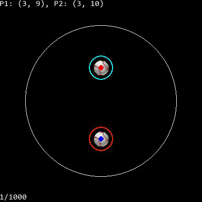

### Hi there 👋

<!--
**ajwm8103/ajwm8103** is a ✨ _special_ ✨ repository because its `README.md` (this file) appears on your GitHub profile.

Here are some ideas to get you started:

- 🔭 I’m currently working on ...
- 🌱 I’m currently learning ...
- 👯 I’m looking to collaborate on ...
- 🤔 I’m looking for help with ...
- 💬 Ask me about ...
- 📫 How to reach me: ...
- 😄 Pronouns: he/him!!!
- ⚡ Fun fact: ...
-->
 

Hi! I'm Andrew Magnuson - a student, AI-enthusiast, and creative programmer. I'm currently studying Engineering Science at the University of Toronto, directing the Virtual Creatures project at UTMIST, and creating music.

### What I'm Listening To

