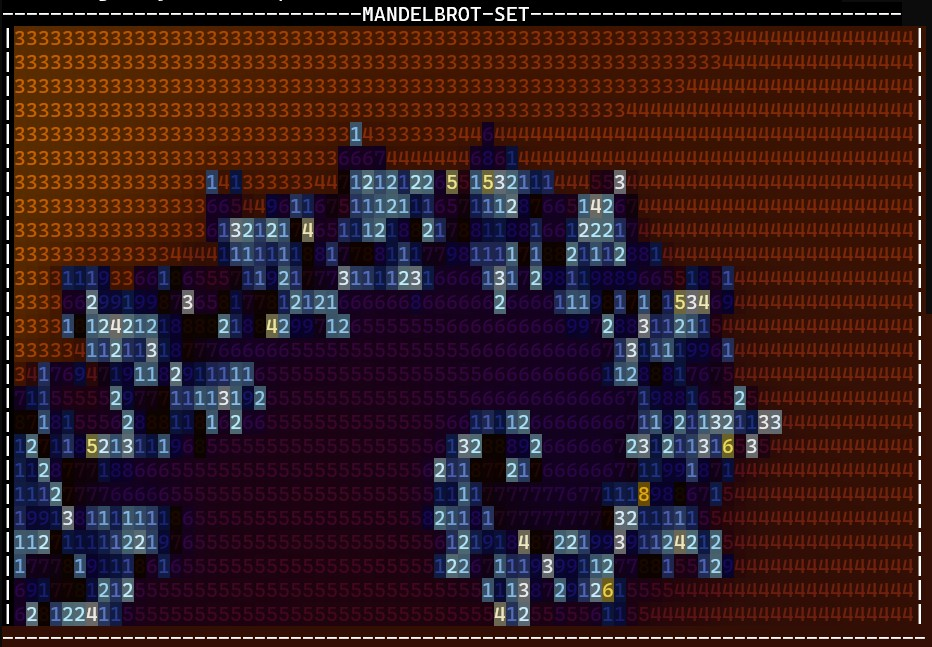
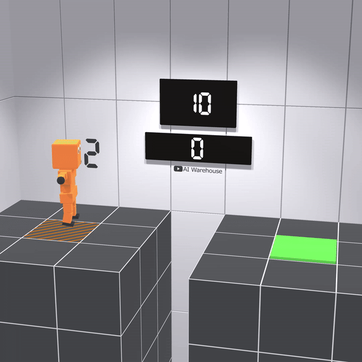
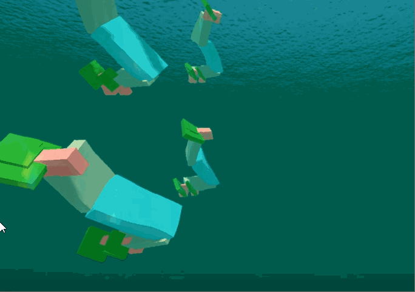
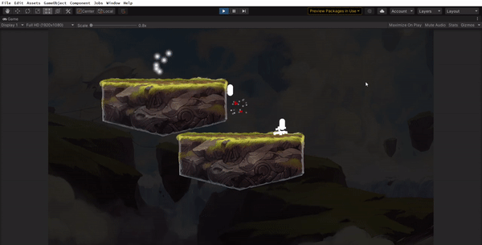

# Andrew Magnuson

<!--
**ajwm8103/ajwm8103** is a ✨ _special_ ✨ repository because its `README.md` (this file) appears on your GitHub profile.

Here are some ideas to get you started:

- 🔭 I’m currently working on ...
- 🌱 I’m currently learning ...
- 👯 I’m looking to collaborate on ...
- 🤔 I’m looking for help with ...
- 💬 Ask me about ...
- 📫 How to reach me: ...
- 😄 Pronouns: he/him!!!
- ⚡ Fun fact: ...
-->
 

 

Hi, I'm Andrew Magnuson - an AI researcher, student, and musician. I'm currently studying Engineering Science at the University of Toronto and working as an intern on the Solutions Architect AI Team at [NVIDIA](https://www.nvidia.com/en-us/ai/). I'm also engaged in research with the [WangLab @ UofT](https://wanglab.ai/), as well as creating educational content as the ML Lead at [AI Warehouse](https://www.youtube.com/@aiwarehouse/videos). Previously, I've served as the Co-President of [UofT's largest undergraduate machine learning club](https://utmist.gitlab.io/), and engaged in research with the [Robot Vision & Learning (RVL) Lab](https://rvl.cs.toronto.edu/#/) and the [CleverHans Lab](https://cleverhans-lab.github.io/).

### What I'm Listening To

  
  
  
  
  

