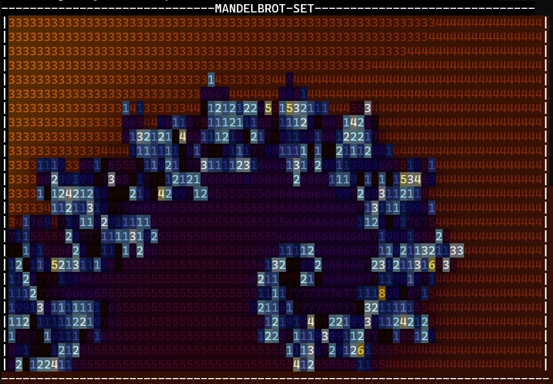
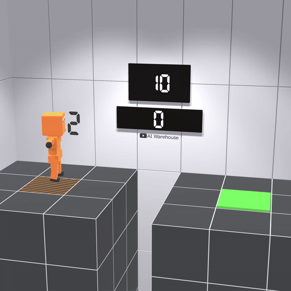
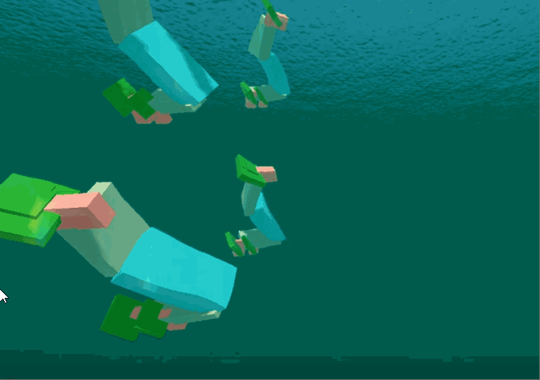
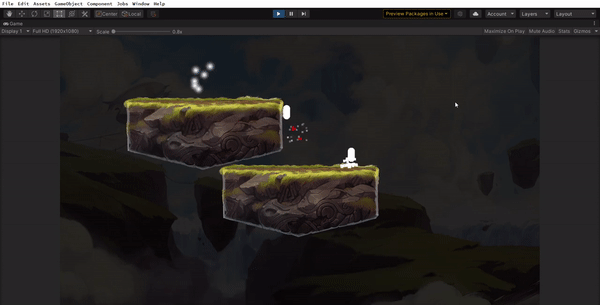

# Andrew Magnuson

<!--
**ajwm8103/ajwm8103** is a ✨ _special_ ✨ repository because its `README.md` (this file) appears on your GitHub profile.

Here are some ideas to get you started:

- 🔭 I’m currently working on ...
- 🌱 I’m currently learning ...
- 👯 I’m looking to collaborate on ...
- 🤔 I’m looking for help with ...
- 💬 Ask me about ...
- 📫 How to reach me: ...
- 😄 Pronouns: he/him!!!
- ⚡ Fun fact: ...
-->
 

 

Hi, I'm Andrew Magnuson - a robotics researcher, YouTube creator, and musician. I'm currently an incoming CMU Master of Science in Robotics, and completed my undergrad in Engineering Science at the University of Toronto. I'm engaged in research with the [MLRG](https://www.gwtaylor.ca/), as well as creating educational content as the RL Lead at [AI Warehouse](https://www.youtube.com/@aiwarehouse/videos). Previously, I've served as the Co-President of [UofT's largest undergraduate machine learning club](https://utmist.gitlab.io/), and engaged in research with the [Robot Vision & Learning (RVL) Lab](https://rvl.cs.toronto.edu/#/), the [Arc Institute](https://arcinstitute.org/), and the [CleverHans Lab](https://cleverhans-lab.github.io/).

Working on multimodal DNA-vision-LLMs @ MLRG and RL @ AI Warehouse. Co-led UofT's Machine Intelligence Student Team. Previously worked on multimodal biological reasoning @ WangLab and the Arc Institute, granular material manipulation @ RVL, and ML regulation @ Vector Institute.

### What I'm Listening To

  
  
  
  
  

